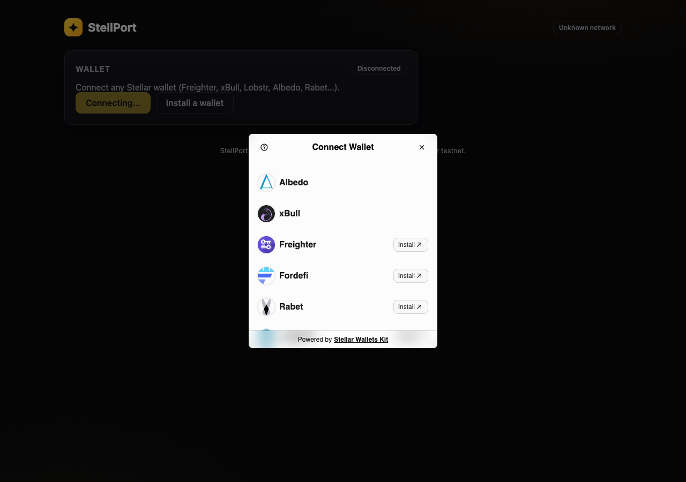
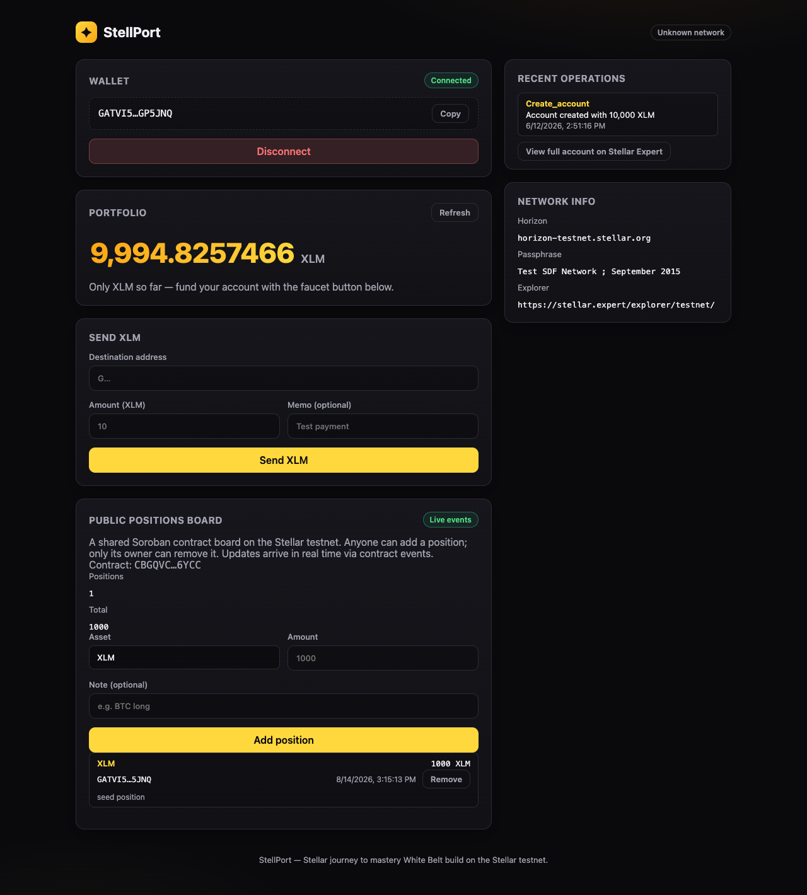
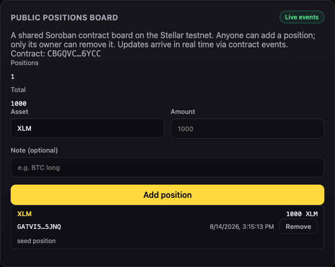
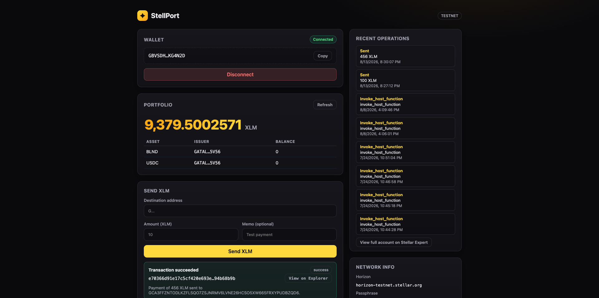
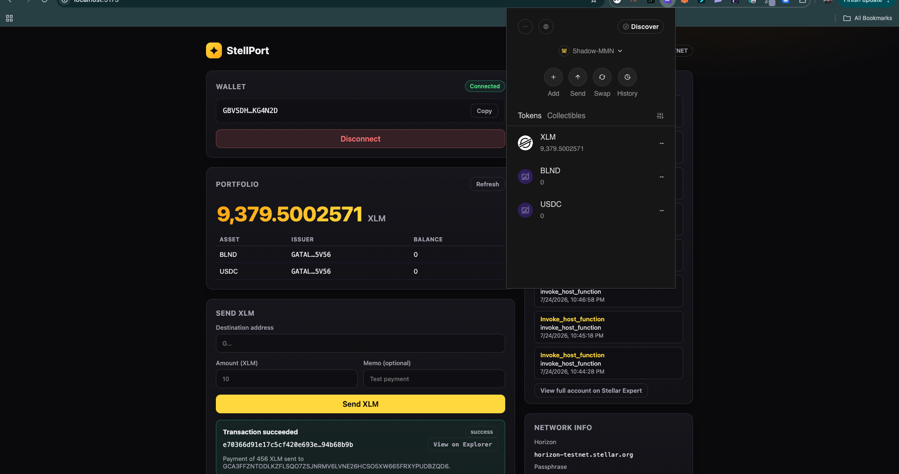
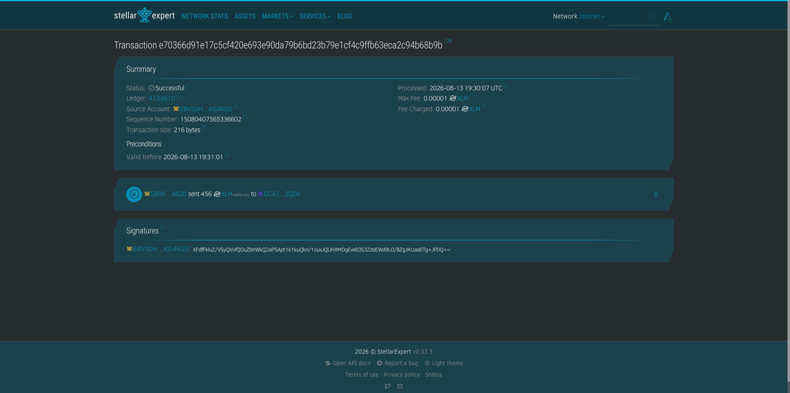

# StellPort


A **Stellar Testnet Wallet & Portfolio** dApp built for the
[Stellar Journey to Mastery](https://www.risein.com/programs/stellar-journey-to-mastery-monthly-builder-challenges)
(Rise In × Stellar Development Foundation) — covering **Level 1 — White Belt** and
**Level 2 — Yellow Belt**.

StellPort is the first slice of a larger portfolio dashboard vision for Stellar
(key project: **StellPort — "One-Click Portfolio & DeFi Dashboard on Stellar"** from our
ecosystem research). Level 1 shipped the foundation: a wallet that connects, reads live
XLM/asset balances, and sends testnet XLM with full transaction feedback. **Level 2** adds
multi-wallet support via StellarWalletsKit and a **deployed Soroban smart contract** — a
shared, public "positions board" that anyone on testnet can write to and watch in real time
through contract events.

---

## Features

- **Multi-wallet connect / disconnect** — one picker for Freighter, xBull, Lobstr, Albedo,
  Rabet, Hana, Klever, OneKey, Bitget and more via StellarWalletsKit v2
- **Live balance fetching** from Stellar testnet — XLM plus all issued assets (portfolio view)
- **Send XLM** to any Stellar address in one transaction, with optional memo
- **Transaction feedback** — success / failure / pending states, with the transaction hash
  and a direct **Stellar Expert** explorer link
- **Testnet faucet** — one-click funding via the Stellar Friendbot (10,000 test XLM)
- **Deployed Soroban contract** — a public positions board anyone can read and add to
- **Real-time contract events** — `PositionAdded` / `PositionRemoved` are streamed live
  into the board via Soroban RPC `getEvents` polling
- **Recent operations** history and **network info** panel
- Auto-refresh when the account or network changes (StellarWalletsKit state events)

## Level 1 — White Belt coverage

| Requirement                                                                            | Where it lives                                                | Evidence                                                                 |
| -------------------------------------------------------------------------------------- | ------------------------------------------------------------- | ------------------------------------------------------------------------ |
| **Freighter wallet + Stellar Testnet**                                                 | README prereqs + in-app install prompt                        | [Dashboard](screenshots/every-operation.png)                              |
| **Connect / disconnect wallet**                                                        | [`WalletCard.jsx`](src/components/WalletCard.jsx)              | [Dashboard](screenshots/every-operation.png)                              |
| **Fetch XLM balance & display in UI**                                                  | [`PortfolioCard.jsx`](src/components/PortfolioCard.jsx)        | [Dashboard](screenshots/every-operation.png) + [Balance](screenshots/2-balance.png) |
| **Send an XLM transaction on testnet**                                                 | [`SendCard.jsx`](src/components/SendCard.jsx) + [`lib/stellar.js`](src/lib/stellar.js) | [On-chain tx](screenshots/3-successful-transaction.png)                   |
| **Success / failure + transaction hash shown**                                         | [`SendCard.jsx`](src/components/SendCard.jsx)                  | [Dashboard](screenshots/every-operation.png) (result box + "View on Explorer") |
| **10+ meaningful commits**                                                             | Repo history (26 commits)                                      | [`git log`](https://github.com/Shadow-MMN/stellport/commits/main)         |

## Level 2 — Yellow Belt coverage

| Requirement                                                                               | Where it lives                                                                         | Evidence                                                                                  |
| ----------------------------------------------------------------------------------------- | -------------------------------------------------------------------------------------- | ----------------------------------------------------------------------------------------- |
| **Multi-wallet support (StellarWalletsKit)**                                              | [`lib/wallet.js`](src/lib/wallet.js) + [`WalletCard.jsx`](src/components/WalletCard.jsx) | [Wallet options](screenshots/level2-wallet-options.png)                                   |
| **Deploy a contract to Stellar testnet**                                                  | [`contracts/portfolio-tracker`](contracts/portfolio-tracker) (soroban-sdk 27)            | [Deployed contract](https://stellar.expert/explorer/testnet/contract/CBGQVC3NSIERUM6P23WB5RMQBC7QSQ7MTBEDPZVU7PFAD2SDMMEM6YCC) |
| **Contract interactivity (call contract from frontend)**                                  | [`lib/contract.js`](src/lib/contract.js) + [`PositionsBoard.jsx`](src/components/PositionsBoard.jsx) | [Positions board](screenshots/level2-positions-board.png)                    |
| **Read/write contract data**                                                              | `get_positions` / `add_position` / `remove_position` via `contract.Client`              | [Dashboard](screenshots/level2-connected-dashboard.png) (positions + total shown)          |
| **Real-time contract events (write/read listeners)**                                      | [`fetchContractEvents`](src/lib/contract.js) polling `rpc.getEvents`                     | "Live events" pill in [Positions board](screenshots/level2-positions-board.png)            |
| **Transaction status tracking**                                                           | `pollTransaction` + `StatusPill` in [PositionsBoard.jsx](src/components/PositionsBoard.jsx) | [Dashboard](screenshots/level2-connected-dashboard.png)                                   |
| **3+ error types handled (wallet not found, rejected, insufficient balance)**             | [`classifyWalletError`](src/lib/wallet.js) (also network mismatch, timeout)              | In-app error messages (connect / send / add position flows)                               |
| **10+ meaningful commits**                                                                | Repo history (26 commits)                                                              | [`git log`](https://github.com/Shadow-MMN/stellport/commits/main)                         |

### Level 2 revision verification

This submission was developed incrementally across 26 meaningful commits,
not as a single bulk-commit dump. The history includes separate implementation
and fix commits for the Stellar service layer, wallet integration, Soroban
contract, contract client, positions board, event synchronization, ownership
indexing, screenshots, and documentation. The complete public history is
available in the [GitHub commit log](https://github.com/Shadow-MMN/stellport/commits/main).

The Level 2 requirements are demonstrated by the deployed testnet contract,
connected dashboard screenshots, multi-wallet picker screenshot, positions
board screenshot, and on-chain transaction links documented below.

## Screenshots

### 1 · Multi-wallet options (StellarWalletsKit picker)



### 2 · Connected dashboard with contract board

The full dashboard shows the connected wallet, live balances, and the public positions
board reading live on-chain data from the deployed Soroban contract.



### 3 · Public Positions Board (live contract data)



### 4 · Full dashboard — wallet connected, balance & transaction result shown (Level 1)



### 5 · Balance displayed (Level 1)



### 6 · Successful testnet transaction (Level 1)



---

## What's under the hood

| Piece          | Tech                                                                                         |
| -------------- | -------------------------------------------------------------------------------------------- |
| App shell      | React 19 + Vite                                                                              |
| Stellar SDK    | `@stellar/stellar-sdk` v16 (Horizon, Soroban `contract.Client`, `rpc.Server`)                |
| Wallet         | `@creit-tech/stellar-wallets-kit` v2 (multi-wallet: Freighter, xBull, Lobstr, Albedo, Rabet…) |
| Soroban        | `soroban-sdk` 27 (Rust) — contract workspace in `contracts/portfolio-tracker`                 |
| Network        | Stellar **Testnet** (`https://horizon-testnet.stellar.org` / `https://soroban-testnet.stellar.org`) |
| Faucet         | Stellar Friendbot (`https://friendbot.stellar.org`)                                          |
| Explorer       | [Stellar Expert — Testnet](https://stellar.expert/explorer/testnet/)                         |

### Deployed contract

- **Contract**: `CBGQVC3NSIERUM6P23WB5RMQBC7QSQ7MTBEDPZVU7PFAD2SDMMEM6YCC`
- **Deploy tx**: `e70492c65907f0da5ddb56f34b6cfcf87f2a72478a212e8b788d3f56100aec8b`
- **Contract call tx** (`add_position`): `833c360e3b170e39ae6fb5460d603782e6d8a751104e9dc8100bb8dbeb8027b7`
- [View on Stellar Expert](https://stellar.expert/explorer/testnet/contract/CBGQVC3NSIERUM6P23WB5RMQBC7QSQ7MTBEDPZVU7PFAD2SDMMEM6YCC)

## Prerequisites

- [Node.js 18+](https://nodejs.org/)
- A Stellar wallet browser extension: [Freighter](https://www.freighter.app/),
  [xBull](https://xbull.app/), [LOBSTR](https://lobstr.co/), [Albedo](https://albedo.link/) or
  Rabet — switched to the **Testnet** network

## Setup (run locally)

```bash
# 1. Clone the repository
git clone https://github.com/Shadow-MMN/stellport.git
cd stellport

# 2. Install dependencies
npm install

# 3. Start the dev server
npm run dev

# 4. Open the printed URL (usually http://localhost:5173)
```

### Try the full flow

1. Open the app — if no wallet is installed, use the **Install a wallet** link.
2. Click **Connect wallet** and pick any wallet in the modal (Freighter, xBull, Lobstr…).
   Approve the request in the wallet popup.
3. The app shows your public address, the active network, and your balances.
4. If your account is unfunded, click **Fund my wallet with 10,000 XLM** (testnet faucet).
5. Fill in a **destination address** (any valid `G…` testnet address), an amount, and
   optionally a memo, then click **Send XLM**.
6. Approve/sign in the wallet popup. The result box shows **success / failure** and the
   **transaction hash** with a **View on Explorer** link.
7. On the **Public Positions Board**, add a position (asset, amount, note). Approve the
   sign request. The new position appears on the board instantly — including on any other
   open browser tab, streamed via contract events.
8. Only the position's owner can **Remove** it; anyone else gets an error.
9. Verify on Stellar Expert that the transactions exist, then refresh to see balances update.

You can also grab a random funded testnet address to send to:
run `node -e "console.log(require('@stellar/stellar-sdk').Keypair.random().publicKey())"`
and fund it with `curl "https://friendbot.stellar.org?addr=<ADDRESS>"`.

## Project layout

```
src/
  App.jsx                    # App shell, state, wallet change-watcher, data loading
  lib/stellar.js             # Horizon logic: balances, send, faucet, explorer links
  lib/wallet.js              # StellarWalletsKit v2: multi-wallet connect/sign + error mapping
  lib/contract.js            # Soroban service layer: client, reads/writes, events, tx status
  components/
    WalletCard.jsx           # Connect / disconnect + install prompt
    PortfolioCard.jsx        # XLM + asset balances, refresh
    SendCard.jsx             # Send XLM form + success/failure/hash feedback
    PositionsBoard.jsx       # Public positions board: add/remove, live events, tx status
    FaucetCard.jsx           # Friendbot one-click funding
    RecentPayments.jsx       # Recent operations for the account
    ErrorBoundary.jsx        # Renders errors instead of a blank screen
    StatusPill.jsx           # Tiny shared badges / copy button

contracts/
  portfolio-tracker/         # Soroban contract workspace (soroban-sdk 27)
    contracts/portfolio_tracker/src/lib.rs   # Contract + events
    contracts/portfolio_tracker/src/test.rs  # 9 unit tests
```

## Verification

- `npm run dev` — run locally
- `npm run build` — production build
- `npm run lint` — oxlint
- `cargo test --release` (in `contracts/portfolio-tracker`) — 9 contract tests

All functionality was verified against the live testnet:
Friendbot funding → balance read → signed payment (`transaction successful: true`) →
contract deploy → `add_position` / `remove_position` writes → `get_positions` reads →
real-time `PositionAdded` / `PositionRemoved` events streamed into the UI.

## Roadmap

StellPort keeps growing toward the full **Stellar portfolio & DeFi dashboard** described in
our ecosystem research (liquidity pools, yield strategies, valuations). Level 2 delivered
multi-wallet support and a live Soroban positions board; future levels will add more
contracts, richer position tracking, and DeFi integrations.

## Level 3 — Advanced Smart Contracts + Production-Ready dApp

StellPort's Level 3 implementation is included in this repository. The app is
still intentionally configured for Stellar testnet while the production
workflow is validated.

### Completed requirements

- **Advanced contract logic:** `sync_position` reads a live position from an
  external Soroban contract through the `PositionSource` interface, then stores
  an authorized snapshot in the registry. Add/remove operations remain owner-
  authorized and emit typed events.
- **Inter-contract communication:** the contract test registers a source
  contract and verifies that the registry records the value returned by that
  contract. The frontend service layer exposes the same flow through
  `syncPosition`.
- **Event streaming:** `PositionsBoard` polls Soroban events using a cursor,
  refreshes the registry snapshot when events arrive, and shows live/syncing
  status with resilient RPC error handling.
- **CI/CD:** `.github/workflows/ci.yml` runs frontend tests, lint, production
  build, and Rust contract tests on pushes and pull requests.
- **Deployment workflow:** `contracts/portfolio-tracker/deploy-testnet.sh`
  builds the WASM and prints a secret-safe Stellar CLI deployment command.
- **Responsive frontend:** the dashboard collapses to a single mobile column,
  forms switch to one column on narrow screens, and loading, pending, success,
  error, and empty states are represented in the UI.
- **Tests:** `npm test` covers four portfolio/data-flow behaviors; the Rust
  suite covers authorization, ordering, ownership, totals, events, and
  inter-contract synchronization.
- **Production architecture:** Horizon, wallet, Soroban RPC, and pure
  portfolio selectors are separated into service modules; `ErrorBoundary`
  protects dashboard sections and event polling keeps the last good snapshot
  when RPC is temporarily unavailable.

### Level 3 evidence to capture before submission

Screenshots and a demo video should be captured from the live deployment, not
fabricated in source control.

| Evidence | Capture location |
| --- | --- |
| Mobile responsive UI | Browser devtools at a mobile viewport |
| CI/CD running | GitHub Actions run for `.github/workflows/ci.yml` |
| 3+ passing tests | Combined `npm test` and `cargo test --release` output |
| Contract address | Deployed contract listed above |
| Interaction transaction | `add_position` transaction listed above |
| Demo video | Connect, fund, add position, live event, remove position |
