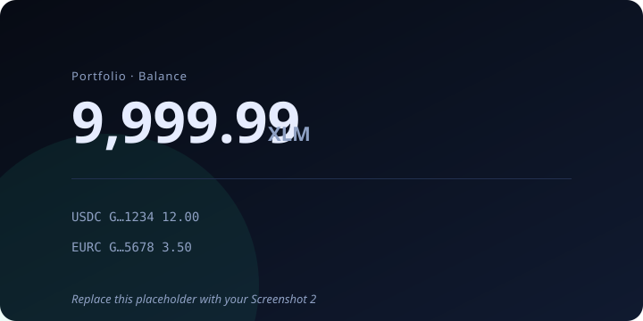
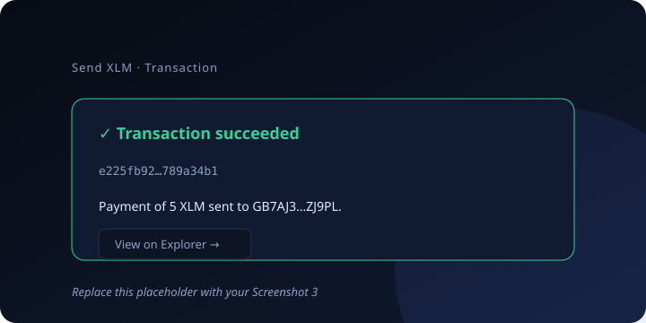
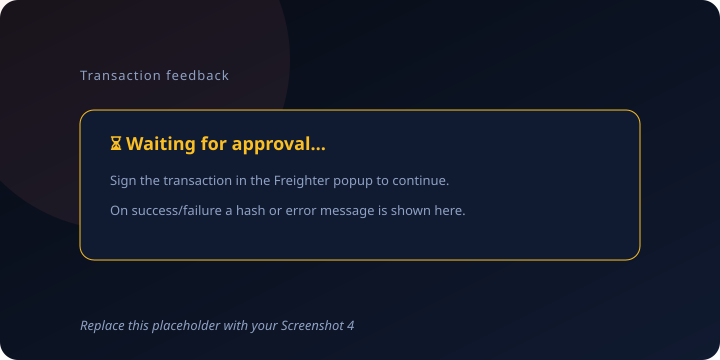

# StellPort

A **Stellar Testnet Wallet & Portfolio** dApp built for **Level 1 — White Belt** of the
[Stellar Journey to Mastery](https://www.risein.com/programs/stellar-journey-to-mastery-monthly-builder-challenges)
(Rise In × Stellar Development Foundation).

StellPort is the first slice of a larger portfolio dashboard vision for Stellar
(key project: **StellPort — "One-Click Portfolio & DeFi Dashboard on Stellar"** from our
ecosystem research). This level ships its foundation: a wallet that connects to Freighter,
reads an account's live XLM/asset balances, and sends testnet XLM with full transaction
feedback.

## Features

- **Wallet connect / disconnect** through the Freighter browser extension
- **Live balance fetching** from Stellar testnet — XLM plus all issued assets (portfolio view)
- **Send XLM** to any Stellar address in one transaction, with optional memo
- **Transaction feedback** — success / failure / pending states, with the transaction hash
  and a direct **Stellar Expert** explorer link
- **Testnet faucet** — one-click funding via the Stellar Friendbot (10,000 test XLM)
- **Recent operations** history and **network info** panel
- Auto-refresh when the account or network changes (Freighter `WatchWalletChanges`)

## What's under the hood

| Piece | Tech |
| --- | --- |
| App shell | React 19 + Vite |
| Stellar SDK | `@stellar/stellar-sdk` v16 (Horizon, testnet) |
| Wallet | `@stellar/freighter-api` v6 (`requestAccess`, `getAddress`, `signTransaction`) |
| Network | Stellar **Testnet** (`https://horizon-testnet.stellar.org`) |
| Faucet | Stellar Friendbot (`https://friendbot.stellar.org`) |
| Explorer | [Stellar Expert — Testnet](https://stellar.expert/explorer/testnet/) |

## Prerequisites

- [Node.js 18+](https://nodejs.org/)
- [Freighter](https://www.freighter.app/) browser extension (Chrome / Brave / Firefox)
- A Freighter account switched to the **Testnet** network
  (Freighter → Settings → Network → Switch to Testnet)

## Setup (run locally)

```bash
# 1. Clone the repository
git clone https://github.com/Shadow-MMN/stellport.git
cd stellport

# 2. Install dependencies
npm install

# 3. Start the dev server
npm run dev

# 4. Open the printed URL (usually http://localhost:5173)
```

### Try the full flow

1. Open the app — if Freighter isn't installed, use the **Install Freighter** link.
2. Click **Connect Freighter** and approve the request in the popup.
3. The app shows your public address, the active network, and your balances.
4. If your account is unfunded, click **Fund my wallet with 10,000 XLM** (testnet faucet).
5. Fill in a **destination address** (any valid `G…` testnet address), an amount, and
   optionally a memo, then click **Send XLM**.
6. Approve/sign in the Freighter popup. The result box shows **success / failure** and the
   **transaction hash** with a **View on Explorer** link.
7. Verify on Stellar Expert that the transaction exists, then refresh to see balances update.

You can also grab a random funded testnet address to send to:
run `node -e "console.log(require('@stellar/stellar-sdk').Keypair.random().publicKey())"`
and fund it with `curl "https://friendbot.stellar.org?addr=<ADDRESS>"`.

## Screenshots

> Replace the remaining placeholder SVGs in [`/screenshots`](./screenshots) with real
> captures (Command/Ctrl+Shift+S in your browser) before submitting.








### How the required states look

1. **Wallet connected** — the Wallet card shows the green *Connected* pill, your address, and a Disconnect button.
2. **Balance displayed** — the Portfolio card shows the big XLM amount (and any other assets).
3. **Successful testnet transaction** — the Send card result box turns green with **Transaction succeeded**, the hash, and the explorer link.
4. **Transaction result shown** — the result box always renders a state (pending / success / failure), so the user always knows what happened.

## Project layout

```
src/
  App.jsx                 # App shell, state, Freighter change-watcher, data loading
  lib/stellar.js          # All Stellar logic: connect, balances, send, faucet, explorer links
  components/
    WalletCard.jsx        # Connect / disconnect + install prompt
    PortfolioCard.jsx     # XLM + asset balances, refresh
    SendCard.jsx          # Send XLM form + success/failure/hash feedback
    FaucetCard.jsx        # Friendbot one-click funding
    RecentPayments.jsx    # Recent operations for the account
    StatusPill.jsx        # Tiny shared badges / copy button
```

## Verification

- `npm run dev` — run locally
- `npm run build` — production build
- `npm run lint` — oxlint

All functionality was verified against the live testnet (Friendbot funding → balance read → signed payment → `transaction successful: true` + hash).

## Roadmap

StellPort is designed to grow: Level 2 will add multi-asset support, Soroban contract
positions, and real-time sync — moving toward the full **Stellar portfolio & DeFi dashboard**
described in our ecosystem research (liquidity pools, yield strategies, valuations).